<div align="center" class="text-center">
  <h1>42-Multilayer_Perceptron</h1>
  
  
  
  
  <p><em>Built with the tools and technologies:</em></p>
  
  
  
</div>

<h2>Table of Contents</h2>
<ul class="list-disc pl-4 my-0">
  <li class="my-0"><a href="#overview">Overview</a></li>
  <ul class="list-disc pl-4 my-0">
    <li class="my-0"><a href="#install-a-great-virtual-environment">Install a great virtual environment</a></li>
    <li class="my-0"><a href="#mathematical-concept">Mathematical concept</a></li>
  </ul>
  <li class="my-0"><a href="#build-a-multilayer-perceptron-mlp">Build a Multilayer Perceptron (MLP)</a>
  <ul class="list-disc pl-4 my-0">
    <li class="my-0"><a href="#usage">Usage</a></li>
  </ul>
  </li>
</ul>

<h2>Overview</h2>
<h3>Install a great virtual environment</h3>

```bash
uv venv                                         # creation
source .venv/bin/activate                       # activation

uv pip install numpy                            # installation of dependencies
```

<h3>Mathematical concept</h3>

#### Standard ML Pipeline

```mermaid
graph LR
    A[📊 Raw Data] --> B[📏 Normalization]
    B --> C[✂️ Split train/validation/test]
    C --> D[✂️ Batching]
    D --> E[🎯 Forward pass = prediction]
    E --> F[📈 Loss function]
    F --> G{Threshold or Early stopping ?}
    G --> |Yes| H[✅ Best Model]
    G --> |No| I[🔄 Backpropagation = gradient]
    I --> J[🔄 Gradient descent = MAJ gradients]
```



<h2>Build a Multilayer Perceptron (MLP)</h2>
<h3>Usage</h3>

```bash
python mlp.py --help
python mlp.py --dataset data.csv --split 0.6,0.3
python mlp.py --dataset datasets/train_set.csv
python mlp.py --dataset datasets/test_set.csv --predict saved_model.npy
```
