<div align="center" class="text-center">
  <h1>42-Multilayer_Perceptron</h1>
  
  
  
  
  <p><em>Built with the tools and technologies:</em></p>
  
  
  
</div>

<h2>Table of Contents</h2>
<ul class="list-disc pl-4 my-0">
  <li class="my-0"><a href="#overview">Overview</a></li>
  <ul class="list-disc pl-4 my-0">
    <li class="my-0"><a href="#install-a-great-virtual-environment">Install a great virtual environment</a></li>
    <li class="my-0"><a href="#mathematical-concept">Mathematical concept</a></li>
  </ul>
  <li class="my-0"><a href="#build-a-multilayer-perceptron-mlp">Build a Multilayer Perceptron (MLP)</a>
  <ul class="list-disc pl-4 my-0">
    <li class="my-0"><a href="#architecture">Architecture</a></li>
    <li class="my-0"><a href="#usage">Usage</a></li>
  </ul>
  </li>
</ul>

<h2>Overview</h2>
<h3>Install a great virtual environment</h3>

```bash
uv venv                                         # creation
source .venv/bin/activate                       # activation

uv pip install numpy                            # installation of dependencies
```

<h3>Mathematical concept</h3>

#### Multilayer Perceptron

> **Definition:** feedforward (information flows from the input layer to the output layer only) neural network model with at least 1-2 hidden layers.

MLP stacks several perceptrons organized in **layers**, each of which:
- takes the output of the previous layer
- transforms the space
- simplifies the problem

> **Universal approximation theorem:** a combination of simple functions can approximate any complex function.

#### Standard ML Pipeline

```mermaid
graph LR
    A[📊 Raw Data] --> B[📏 Normalization]
    B --> C[✂️ Split train/validation/test]
    C --> D[✂️ Batching]
    D --> E[🎯 Forward pass = prediction]
    E --> F[📈 Loss function]
    F --> G{Threshold or Early stopping ?}
    G --> |Yes| H[✅ Best Model]
    G --> |No| I[🔄 Backpropagation = gradient]
    I --> J[🔄 Gradient descent = MAJ gradients]
```



#### Formulas

Each layer applies a weighted sum + activation :

**1. Forward Pass**

For each batch, for each layer $l$ :

$$a^{(l)} = f(z^{(l)}) = f(W^{(l)} a^{(l-1)} + b^{(l)})$$

Where:
- $l$ = layer
- $W^{(l)}$ = weight matrix
- $a^{(0)}$ = $x$ (input)
- $a^{(l-1)}$ = output of previous layer
- $b^{(l)}$ = bias
- $f$ = activation function (ReLU, sigmoid…)

> Each layer applies a weighted sum + activation

**Activation Functions:**

| Components | Sigmoid | Softmax | Linear (ReLU) |
| --- | --- | --- | --- |
| Output range | (0, 1) | (0, 1), sum to 1 | [0, +∞) |
| Use case | Binary / multi-label independent | Multi-class (mutually exclusive) | Hidden layers |
| Output structure | Single probability per neuron | Probability distribution | Non-linear activation |
| Advantages | Interpretable | Probabilistic | Simple, fast |
| Disadvantages | Saturation | Coupled to CE | Dead neurons |
| **Formula** | $\sigma(z) = \frac{1}{1 + e^{-z}}$ | $\text{softmax}(z_K) = \frac{e^{z_K}}{\sum_{j=1}^K e^{z_j}}$ | $\text{ReLU}(z) = \max(0, z)$ |

**Usage Rules:**
- **Hidden layers**: ReLU (standard), sometimes Sigmoid/Tanh
- **Output layer**:
  - Regression: Linear (no activation)
  - Binary classification: Sigmoid
  - Multi-class classification: Softmax

**2. Loss Function**

Measures the error: $L(\hat{y}, y)$

| Problem type | Loss function | Formula |
| --- | --- | --- |
| Binary classification | Binary Cross-Entropy | $\text{BCE} = -[y \log(\hat{y}) + (1-y) \log(1-\hat{y})]$ |
| Multi-class classification | Categorical Cross-Entropy | $\text{CCE} = -\sum_i y_i \log(\hat{y}_i)$ |
| Regression | Mean Squared Error | $\text{MSE} = \frac{1}{2m} \sum_i (\hat{y}_i - y_i)^2$ |

**3. Backpropagation**

Computes how each weight contributed to the error, by propagating gradients from output to input.

One layer: $a^{(l)} = f(z^{(l)})$

Layer error:
$$\delta^{(l)} = \frac{\partial L}{\partial z^{(l)}}$$

**Gradient Computation:**

| Element | Gradient |
| --- | --- |
| **Output layer** | $\delta^{(L)} = \hat{y} - y$ (Softmax+CE or Sigmoid+BCE) |
| **Hidden layer** | $\delta^{(l)} = (W^{(l+1)T} \delta^{(l+1)}) \odot f'(z^{(l)})$ |

**4. Gradient Descent**

| Element | Formula |
| --- | --- |
| Weight gradient | $\frac{\partial L}{\partial W^{(l)}} = \delta^{(l)} a^{(l-1)T}$ |
| Bias gradient | $\frac{\partial L}{\partial b^{(l)}} = \delta^{(l)}$ |
| Update | $W^{(l)} \leftarrow W^{(l)} - \eta \frac{\partial L}{\partial W^{(l)}}$ |

New weights = old weights - (learning rate × weight gradient)

**5. Stopping Criteria**

- Maximum epochs reached
- Loss < minimal threshold (e.g., loss < 0.001)
- **Early stopping** (validation loss plateaus)
- Gradient ≈ 0 (convergence reached)


<h2>Build a Multilayer Perceptron (MLP)</h2>
<h3>Architecture</h3>

```
multilayer-perceptron/
├── config/
│   └── network_config.txt # Exemple de config
├── datasets/              # Created with the splitting flag
│   ├── test_set.csv
│   ├── train_set.csv
│   └── valid_set.csv
├── src/
│   ├── activations.py
│   ├── config.py
│   ├── losses.py
│   ├── my_mlp.py          # Class MLP
│   ├── parsing.py
│   ├── preprocessing.py
│   ├── split_data.py
│   └── utils.py
├── test/                  # Script bash testeur 
|   ├── cli_parsing.sh
|   ├── config_parsing.sh
|   ├── file_management.sh
|   └── mlp_training.sh
├── mlp.py                 # Main entry point (lightweight)
└── saved_model.npy        # Model saved by the training flag

```

<h3>Usage</h3>

```bash
usage: mlp.py [-h] --dataset DATASET [--split SPLIT]
              [--predict PREDICT] [--config CONFIG]
              [--layer LAYER [LAYER ...]] [--epochs EPOCHS]
              [--learning_rate LEARNING_RATE] [--batch_size BATCH_SIZE]
              [--loss {binaryCrossentropy,categoricalCrossentropy}]
              [--input_size INPUT_SIZE] [--output_size OUTPUT_SIZE]
              [--activation_hidden {sigmoid,relu,tanh}]
              [--activation_output {sigmoid,softmax,linear}]
              [--weights_init {heUniform,heNormal,xavierUniform,random}]

Multilayer Perceptron for binary classification

options:
  -h, --help            show this help message and exit
  --dataset DATASET     Path to dataset CSV file
  --split SPLIT         Split ratio (format: train,valid). Ex: 0.7,0.15
  --predict PREDICT     Path to saved model for prediction
  --config CONFIG       Path to config file (.txt)
  --layer LAYER [LAYER ...]
                        Hidden layer sizes ∈ ℕ*. Ex: --layer 24 24 24
  --epochs EPOCHS       Number of training epochs ∈ ℕ*
  --learning_rate LEARNING_RATE
                        Learning rate ∈ [0, 1]
  --batch_size BATCH_SIZE
                        Batch size ∈ ℕ*
  --loss {binaryCrossentropy,categoricalCrossentropy}
                        Loss function
  --input_size INPUT_SIZE
                        Input size ∈ [1, +inf] (number of features)
  --output_size OUTPUT_SIZE
                        Output size ∈ [1, +inf] (number of classes)
  --activation_hidden {sigmoid,relu,tanh}
                        Activation function for hidden layers
  --activation_output {sigmoid,softmax,linear}
                        Activation function for output layer
  --weights_init {heUniform,heNormal,xavierUniform,random}
                        Weights initialization method
```
