<div align="center" class="text-center">
  <h1>42-Multilayer_Perceptron</h1>
  
  
  
  
  <p><em>Built with the tools and technologies:</em></p>
  
  
  
</div>

<h2>Table of Contents</h2>
<ul class="list-disc pl-4 my-0">
  <li class="my-0"><a href="#overview">Overview</a></li>
  <ul class="list-disc pl-4 my-0">
    <li class="my-0"><a href="#install-a-great-virtual-environment">Install a great virtual environment</a></li>
    <li class="my-0"><a href="#mathematical-concept">Mathematical concept</a></li>
  </ul>
  <li class="my-0"><a href="#build-a-multilayer-perceptron-mlp">Build a Multilayer Perceptron (MLP)</a>
  <ul class="list-disc pl-4 my-0">
    <li class="my-0"><a href="#usage">Usage</a></li>
  </ul>
  </li>
</ul>

<h2>Overview</h2>
<h3>Install a great virtual environment</h3>

```bash
uv venv                                         # creation
source .venv/bin/activate                       # activation

uv pip install numpy                            # installation of dependencies
```

<h3>Mathematical concept</h3>

#### Multilayer Perceptron

> **Definition:** feedforward (information flows from the input layer to the output layer only) neural network model with at least 1-2 hidden layers.

MLP stacks several perceptrons organized in **layers**, each of which:
- takes the output of the previous layer
- transforms the space
- simplifies the problem

> **Universal approximation theorem:** a combination of simple functions can approximate any complex function.

#### Standard ML Pipeline

```mermaid
graph LR
    A[📊 Raw Data] --> B[📏 Normalization]
    B --> C[✂️ Split train/validation/test]
    C --> D[✂️ Batching]
    D --> E[🎯 Forward pass = prediction]
    E --> F[📈 Loss function]
    F --> G{Threshold or Early stopping ?}
    G --> |Yes| H[✅ Best Model]
    G --> |No| I[🔄 Backpropagation = gradient]
    I --> J[🔄 Gradient descent = MAJ gradients]
```



#### Formulas

Each layer applies a weighted sum + activation :

**1. Linear transformation**

Each neuron computes a weighted sum of its inputs plus a bias:

$$z^{(l)} = W^{(l)} a^{(l-1)} + b^{(l)}$$

Where:
- $a^{(l-1)}$ : output (activation) of the previous layer
- $W^{(l)}$ : weight matrix of layer $l$
- $b^{(l)}$ : bias vector
- $z^{(l)}$ : pre-activation values

**2. Activation function**

A non-linear function is applied to introduce non-linearity:

$$a^{(l)} = f(z^{(l)})$$

Common activation functions:

**Sigmoid:** $\sigma(x) = \frac{1}{1+e^{-x}}$

**ReLU:** $\text{ReLU}(x) = \max(0, x)$

**Tanh:** $\tanh(x) = \frac{e^x - e^{-x}}{e^x + e^{-x}}$

**3. Forward propagation**

By chaining all layers, the network produces a prediction:

$$\hat{y} = a^{(L)}$$

Where $L$ is the last layer of the network.

**4. Loss function**

The loss measures the error between the prediction $\hat{y}$ and the true value $y$.

Example: Mean Squared Error (MSE)

$$L(y, \hat{y}) = \frac{1}{n} \sum_{i=1}^{n} (y_i - \hat{y}_i)^2$$

**5. Backpropagation**

Gradients are computed using the chain rule to update weights and biases:

$$\frac{\partial L}{\partial W^{(l)}}, \quad \frac{\partial L}{\partial b^{(l)}}$$

**6. Gradient descent update**

Parameters are updated iteratively:

$$W^{(l)} = W^{(l)} - \eta \cdot \frac{\partial L}{\partial W^{(l)}}$$

$$b^{(l)} = b^{(l)} - \eta \cdot \frac{\partial L}{\partial b^{(l)}}$$

Where:
- $\eta$ is the learning rate


<h2>Build a Multilayer Perceptron (MLP)</h2>
<h3>Usage</h3>

```bash
python mlp.py --help
python mlp.py --dataset data.csv --split 0.6,0.3
python mlp.py --dataset datasets/train_set.csv
python mlp.py --dataset datasets/test_set.csv --predict saved_model.npy
```
